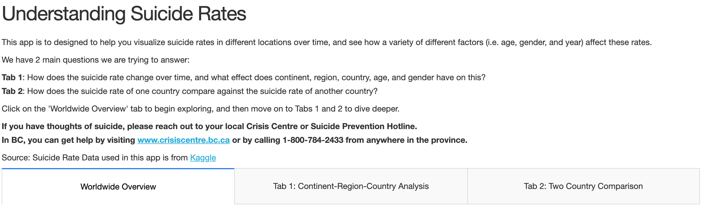
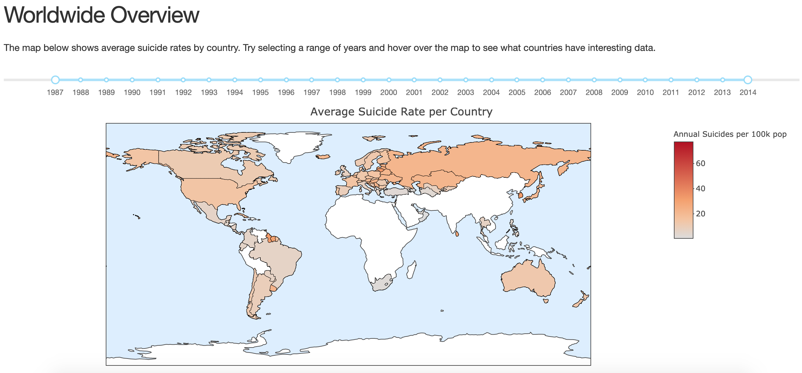
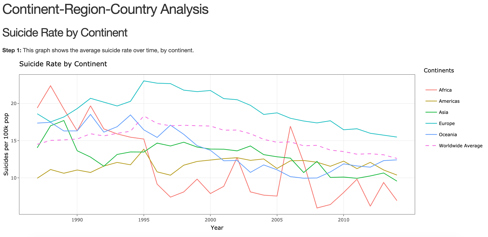
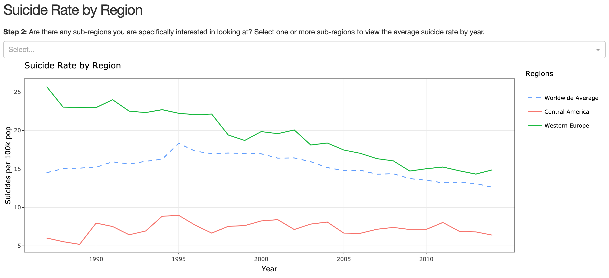
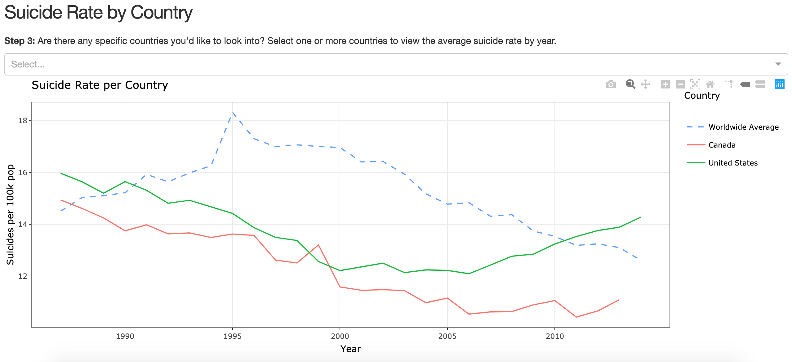
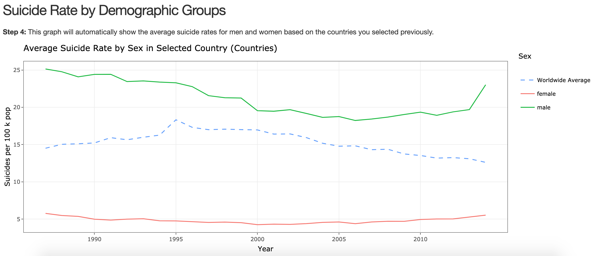
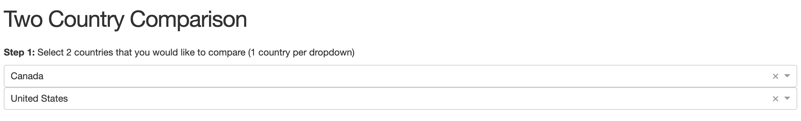
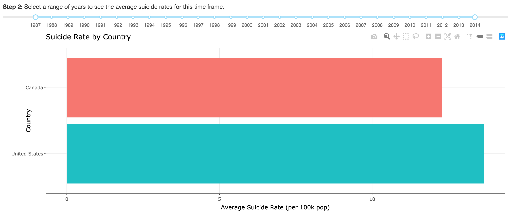
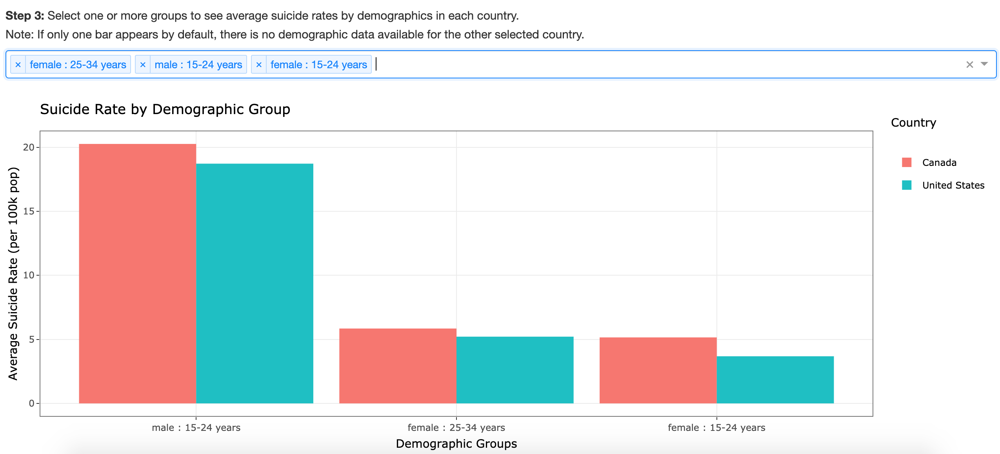

# DSCI 532 Group 102 No Suicide Squad (R Project)
Group 102: Suvarna Moharir, Anny Chih, Manuel Maldonado

[Link to Deployed App]()  
[Link to Reflections for Milestone 4](https://github.com/UBC-MDS/DSCI532_Group102_No-Suicide-Squad-R/blob/master/reflection.md)  
[Link to Code of Conduct](https://github.com/UBC-MDS/DSCI532_Group102_No-Suicide-Squad-R/blob/master/CODE_OF_CONDUCT.md)  
[Link to Contributing file](https://github.com/UBC-MDS/DSCI532_Group102_No-Suicide-Squad-R/blob/master/CONTRIBUTING.md)  
[Link to Licence file](https://github.com/UBC-MDS/DSCI532_Group102_No-Suicide-Squad-R/blob/master/LICENSE)  
[Link to app R file](https://github.com/UBC-MDS/DSCI532_Group102_No-Suicide-Squad-R/blob/master/no_suicide_app.R)  

#### Tab: Worldwide Overview

### Tab 1: Continent-Region-Country Analysis

### Tab 2: Two Country Comparison

